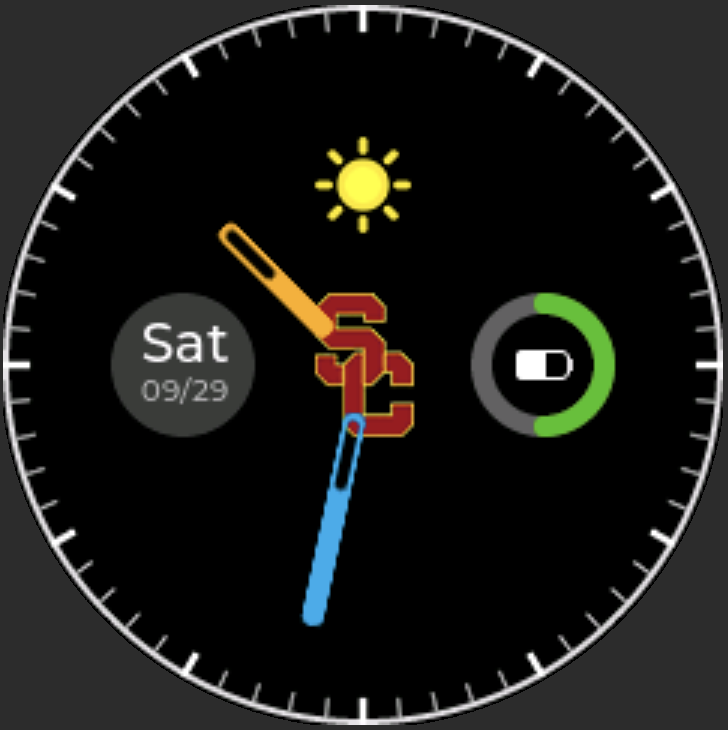
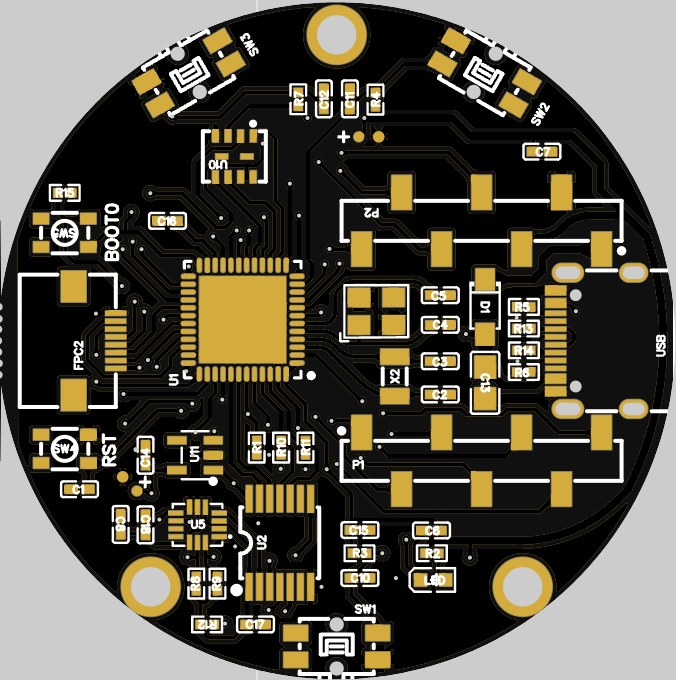
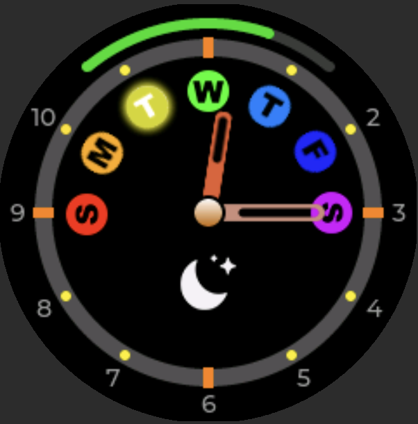
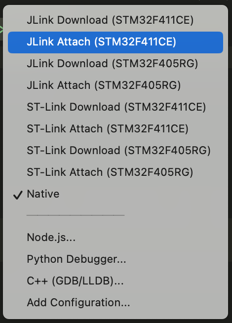

# Metope


<p align="center"> 
    
   
    
</p>


Metope is a project for a smart digital watch system running on the STM32 target.


## Overview

<p align="center">  </p>


Color Capsule contributes to the firmware program. Grey rectangulars are only the auxiliary components.


## Requirement

- `CMake>=3.19.2`
- `make==3.81`

Metope project dosen't require to install the `arm-gnu-tool-chain` on the host system. Tool chain will be provided via `lib/arm-toolchain`


## Workspace Setup

Clone the workspace

```bash
git clone https://github.com/RandleH/Metope.git
```


This chapter only provides one of the recommended way to set up the project. For more details, please visit [here]().

Deploy the environment

```bash
source setup.env
```

> Target: `STM32F411CEU6`


Compile

```bash
sh rebuild.sh
```


The output files will be the following items:

- `build/model1.elf` - Executable Linkable File
- `build/model1.hex` - Hex file for USART download
- `build/model1.bin` - Compact binary to flash the target memory


## Compilation

Metope has a bash script for the convenience of compilation. Please take reference for `Compilation Configuration Zone` in `rebuild.sh`.

<p align="center">  </p>


Here are some typical configurations. Copy the command and replace the one in `rebuild.sh` in the `Compilation Configuration Zone`


### C Make Flag Table

| Keyword \ Allowed Value | 0                 | 1                      | 2    | Debug | Release |
| ----------------------- | ----------------- | ---------------------- | ---- | ----- | ------- |
| CMAKE_BUILD_TYPE        |                   |                        |      | $√$   | $√$     |
| LOG_LEVEL               | **$√$**           | $√$                    | $√$  |       |         |
| QMI8658A                |                   | **$\color{green}(√)$** |      |       |         |
| QMI8658C                |                   | $\color{green}(√)$     |      |       |         |
| MPU6050                 |                   | $\color{green}(√)$     |      |       |         |
| UNIT_TEST               |                   | $\color{cyan}(√)$      |      |       |         |
| INCLUDE_TB_OS           | $\color{cyan}[√]$ | $\color{cyan}[√]$      |      |       |         |
| INCLUDE_TB_BSP          | $\color{cyan}[√]$ | $\color{cyan}[√]$      |      |       |         |
| INCLUDE_TB_CMN          | $\color{cyan}[√]$ | $\color{cyan}[√]$      |      |       |         |


### Environment Setup

#### STM32F411CEU6

>```bash
>source setup.env
>```
>
>Or 
>
>```bash
>source setup.env STM32F411CEU6
>```


#### STM32F405RGT6

```bash
source setup.env STM32F405RGT6
```


#### Native

```bash
source setup.env native
```

This native mode will use your local compiler to partially build the project. This is for the purpose of experiment to test non-machine dependent code.

Note that the main entrance of native program is different than others.

- Native Program: `${PRJ_TOP}/artifacts/main_native.cc`
- Target Program: `${PRJ_TOP}/artifacts/main_program.cc`
- Emulator Program: `${PRJ_TOP}/artifacts/main_emulator.cc`


### Firmware (Debug)

```bash
mkdir build
cd ./build
cmake -DCMAKE_BUILD_TYPE=<value> [-DLOG_LEVEL=<value>] .. && make -j12
```

> Example:
>
> ```
> cmake -DCMAKE_BUILD_TYPE=Debug -DLOG_LEVEL=2 .. && make -j12
> ```
>
> ```
> cmake -DCMAKE_BUILD_TYPE=Debug -DLOG_LEVEL=0 .. && make -j12
> ```


### Firmware (Release)

```bash
mkdir build
cd ./build
cmake -DCMAKE_BUILD_TYPE=Release .. && make -j12
```


### Test Bench (CI)

```bash
mkdir build
cd ./build
cmake -DCMAKE_BUILD_TYPE=Debug -DUNIT_TEST=1 -DINCLUDE_TB_BSP=1 -DINCLUDE_TB_CMN=1 .. && make -j12
```


## Debug

### Vscode

Step 0: Always deploy the environment first.

> ```bash
> source setup.env
> ```
>
> The `.vscode` will be updated here depending on your OS.


Step 1: Install the Vscode extension `Cortex-Debug`


Step 2: Install `J-Link` tools

>```bash
>brew install --cask segger-jlink
>```


Step 3: Select a specific debugging mode



>- `JLink Download` - Download the program to target. You need to compile the project first.
>
>- `JLink Attach` - Attach to the program without downloading. Again you need to compile first.
>
>- `STLink Download` - Same as the J-Link but use ST-Link Port
>
>- `STLink Attach` - Same as the J-Link but use ST-Link Port
>
>- `Native` - This will call native cppdbg. Make sure you have your local compiler installed


## Analog Clock

The angle of hour needle and minute needle has the following property.

Let $\alpha$ be the hour needle angle and $\beta$ be the minute needle angle, where $\alpha,\beta \in [0:3599]$​.

$$
\frac{\beta}{12}= \Delta\alpha
$$

> (1)

$$
\Delta\alpha=\alpha \mod{\frac{3600}{12}}
$$

> (2)


Note  $\xi_{\alpha}$ and $\xi_{\beta}$ be the remainder of escaped time in microseconds. Then

$$
t_{\Delta\alpha} = \Delta\alpha \cdot12000 + \xi_{\alpha}
$$
> (3) where $t_{\Delta\alpha}$ is represented in microseconds

$$
t_{\beta} = \beta \cdot 1000 + \xi_{\beta}
$$
> (4) where $t_{\Delta\beta}$ is represented in microseconds. 


$$
t_{\Delta\alpha} = t_{\Delta\beta}
$$

> (5) The escaped time should always the same.


Therefore `(2)` `(3)` `(4)` `(5)` $\Rightarrow$ `(6)`.


$$
12000 \cdot \left( \alpha \mod{\frac{3600}{12}} \right) + \xi_{\alpha} = \beta \cdot 1000 + \xi_{\beta}
$$

> (6)


Check more details on [desmos](https://www.desmos.com/calculator/9qkivl2gf6),. A live diagram explains a lot.


## Code Conduct

I'd appreciate everybody's efforts to maintain a good, high quality coding environment. Good coding habit increased readability and minimized the bugs. In this project, there are a set of rules on code format.


### Code Section

```c
/* ************************************************************************** */
/*                                    XXXX                                    */
/* ************************************************************************** */
```


### Function

```c
/**
 * @brief Description
 * @param [in]    arg1 - xxxx
 * @param [inout] arg2 - xxxx
 * @param [out]   arg3 - xxxx
 * @return xxxx
 */
int foo( int arg1, int arg2, int arg3){
  // body //
}
```

> Each function must have `brief` | `param` (if exists) | `return` (if exists) in doxygen style.


### Safe Zone Banner

```c
///////////////////////////////////////////////////////////////
/////////////////////// Safe Zone Start ///////////////////////


//////////////////////// Safe Zone End ////////////////////////
///////////////////////////////////////////////////////////////
```


### File Header

```c
/**
 ******************************************************************************
 * @file    xxxx.c
 * @author  RandleH
 * @brief   xxxx
 ******************************************************************************
 * @attention
 *
 * Copyright (c) 2022 RandleH.
 * All rights reserved.
 *
 * This software component is licensed by RandleH under BSD 3-Clause license,
 * the "License"; You may not use this file except in compliance with the
 * License. You may obtain a copy of the License at:
 *                        opensource.org/licenses/BSD-3-Clause
 *
 ******************************************************************************
*/
```


### C Compilation Indication

```c++
#ifdef __cplusplus
extern "C"{
#endif

#ifdef __cplusplus
}
#endif
```


## Lesson Learnt

Sep 3rd, 2025
>Register SR got cleared when inserting a breakpoint in the handler. Consequently the system can not recognize the new RX message because the SR register was cleared.
>
>Do not add the break point ahead of the program reading the register. Because reading the register value means something else in the embedded system. It may clear the internal bits by hardware. Your debugger will sceiently read those value causing register value cleared and this may impact your callflow.


## Utility

- [**Online GDB**](https://www.onlinegdb.com/)
- [**Simulator**](https://wokwi.com)


## Reference

- [**Datasheet - SpeedStudio Round LCD V1.1** ](https://files.seeedstudio.com/wiki/round_display_for_xiao/SeeedStudio_Round_Display_for_XIAO_v1.1_SCH_230407.pdf)
- [**Programming Manual - STM32F4**](https://www.st.com/resource/en/programming_manual/pm0214-stm32-cortexm4-mcus-and-mpus-programming-manual-stmicroelectronics.pdf)
- [**Reference Manual - STM32F405RGT6**](https://www.st.com/resource/en/reference_manual/dm00031020-stm32f405-415-stm32f407-417-stm32f427-437-and-stm32f429-439-advanced-arm-based-32-bit-mcus-stmicroelectronics.pdf)
- [**Reference Manual - STM32F411CEU6**](https://www.st.com/resource/en/reference_manual/rm0383-stm32f411xce-advanced-armbased-32bit-mcus-stmicroelectronics.pdf)
- [**Datasheet - STM32F405RGT6**](https://www.st.com/resource/en/datasheet/stm32f405rg.pdf)
- [**Datasheet - STM32F411CEU6**](https://www.st.com/resource/en/datasheet/stm32f411ce.pdf)
- [**Datasheet - QMI8658A**](https://www.qstcorp.com/upload/pdf/202301/13-52-25%20QMI8658A%20Datasheet%20Rev%20A.pdf)
- [**Datasheet - W25Q32**](https://mm.digikey.com/Volume0/opasdata/d220001/medias/docus/5059/W25Q32JV_RevI_5-4-21.pdf)

- [**Datasheet - LSF0204x**](https://www.ti.com/lit/ds/symlink/lsf0204d.pdf?ts=1733701959935)

- [**IAR Compiler Guide**](https://wwwfiles.iar.com/AVR/webic/doc/EWAVR_CompilerGuide.pdf)
