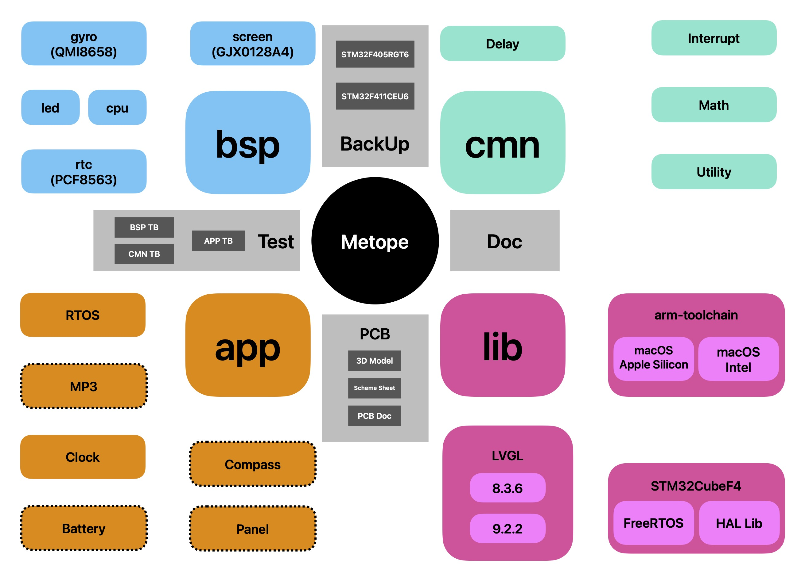
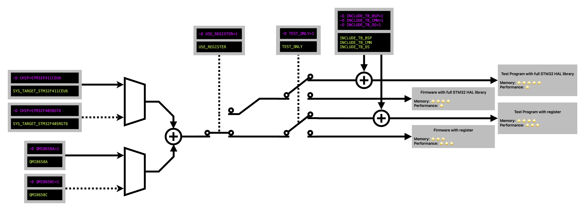

# Metope


<p align="center">    </p>


Metope is a project for a smart digital watch system running on the STM32 target.


## Overview

<p align="center">  </p>


Color Capsule contributes to the firmware program. Grey rectangulars are only the auxiliary components.


## Requirement

- `CMake>=3.19.2`
- `make==3.81`

Metope project dosen't require to install the `arm-gnu-tool-chain` on the host system. Tool chain will be provided via `lib/arm-toolchain`


## Workspace Setup

Clone the workspace

```bash
git clone https://github.com/RandleH/Metope.git
```


Deploy the environment

```bash
source setup.env
```


Compile

```bash
sh rebuild.sh
```


The output files will be the following items:

- `build/model1.elf` - Executable Linkable File
- `build/model1.hex` - Hex file for USART download
- `build/model1.bin`


## Compilation

Metope has a bash script for the convenience of compilation. Please take reference for `Compilation Configuration Zone` in `rebuild.sh`.

<p align="center">  </p>


Here are some typical configurations. Copy the command and replace the one in `rebuild.sh` in the `Compilation Configuration Zone`


### Firmware (Debug)

```bash
cmake -DCMAKE_BUILD_TYPE=Debug -DCHIP=STM32F411CEU6 .. && make -j12
```

>STM32F411CEU6


```bash
cmake -DCMAKE_BUILD_TYPE=Debug -DCHIP=STM32F405RGT6 .. && make -j12
```

> STM32F405RGT6


### Firmware (Release)

```bash
cmake -DCMAKE_BUILD_TYPE=Release -DCHIP=STM32F411CEU6 .. && make -j12
```

> STM32F411CEU6


```
cmake -DCMAKE_BUILD_TYPE=Release -DCHIP=STM32F405RGT6 .. && make -j12
```

> STM32F405RGT6


### Test Bench

```bash
cmake -DCMAKE_BUILD_TYPE=Debug -DCHIP=STM32F411CEU6 -DTEST_ONLY=1 .. && make -j12
```

> STM32F411CEU6


```bash
cmake -DCMAKE_BUILD_TYPE=Debug -DCHIP=STM32F405RGT6 -DTEST_ONLY=1 .. && make -j12
```

> STM32F405RGT6


## Debug

### Vscode

Step 0: Always deploy the environment first.

> ```bash
> source setup.env
> ```
>
> The `.vscode` will be updated here depending on your OS.


Step 1: Install the Vscode extension `Cortex-Debug`


Step 2: Install `J-Link` tools

>```bash
>brew install --cask segger-jlink
>```


Step 3: Select a specific debugging mode

>- `JLink Download (STM32F411CE)` - Download the program to target. You need to compile the project first.
>
>- `JLink Attach (STM32F411CE)` - Attach to the program without downloading. Again you need to compile first.


## Clock


The angle of hour needle and minute needle has the following property.

Let $\alpha$ be the hour needle angle and $\beta$ be the minute needle angle, where $\alpha,\beta \in [0:3599]$
$$
\frac{\beta}{12}= \Delta\alpha
$$

$$
\Delta\alpha=\alpha \mod{\frac{3600}{12}}
$$


$$
t_{\Delta\alpha} = \Delta\alpha \cdot12000 + \xi_{\alpha}
$$
$$
t_{\beta} = \beta \cdot 1000 + \xi_{\beta}
$$
> where $\xi_{\alpha}$​ and $\xi_{\beta}$​ is the remainder of escaped time in microseconds.


$$
t_{\Delta\alpha} = t_{\Delta\beta}
$$

> The escaped time should always the same.


Therefore `(2)` `(3)` `(4)` `(5)` $\Rightarrow$ `(6)`
$$
12000 \cdot ( \alpha \mod{\frac{3600}{12}} ) + \xi_{\alpha} = \beta \cdot 1000 + \xi_{\beta}
$$


## Utility

- [**Online GDB**](https://www.onlinegdb.com/)


## Reference

- [**Programming Manual - STM32F4**](https://www.st.com/resource/en/programming_manual/pm0214-stm32-cortexm4-mcus-and-mpus-programming-manual-stmicroelectronics.pdf)
- [**Reference Manual - STM32F405RGT6**](https://www.st.com/resource/en/reference_manual/dm00031020-stm32f405-415-stm32f407-417-stm32f427-437-and-stm32f429-439-advanced-arm-based-32-bit-mcus-stmicroelectronics.pdf)
- [**Reference Manual - STM32F411CEU6**](https://www.st.com/resource/en/reference_manual/rm0383-stm32f411xce-advanced-armbased-32bit-mcus-stmicroelectronics.pdf)
- [**Datasheet - STM32F405RGT6**](https://www.st.com/resource/en/datasheet/stm32f405rg.pdf)
- [**Datasheet - STM32F411CEU6**](https://www.st.com/resource/en/datasheet/stm32f411ce.pdf)
- [**Datasheet - QMI8658A**](https://www.qstcorp.com/upload/pdf/202301/13-52-25%20QMI8658A%20Datasheet%20Rev%20A.pdf)
- [**Datasheet - W25Q32**](https://mm.digikey.com/Volume0/opasdata/d220001/medias/docus/5059/W25Q32JV_RevI_5-4-21.pdf)

- [**Datasheet - LSF0204x**](https://www.ti.com/lit/ds/symlink/lsf0204d.pdf?ts=1733701959935)
